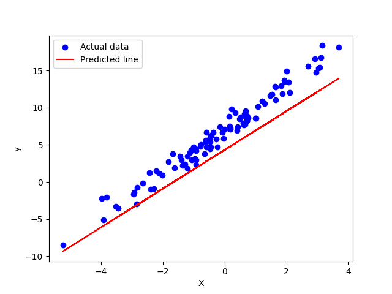
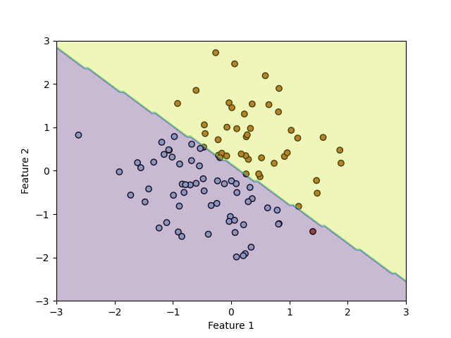

# 🚀 Linear & Logistic Regression from Scratch  

A simple implementation of **Linear Regression** and **Logistic Regression** using **NumPy**, built from scratch without any machine learning libraries. This project includes **model training, prediction, and visualization** with plots.

## 📌 Linear Regression Implementation  
In the **Linear Regression** part of this project:
- We initialize the model with **weights and bias set to zero**.
- We use **gradient descent** to optimize the weights by iteratively updating them based on the cost function.
- The model predicts continuous values using the **linear equation**:
  $$\[ y = Xw + b \]$$
- The loss function used is **Mean Squared Error (MSE)**.
- The plot generated for **Linear Regression** shows the actual data points as a **scatter plot** (blue) and the **best-fit regression line** (red) which the model has learned.

### 📊 Linear Regression Plot  
  

## 📌 Logistic Regression Implementation  
In the **Logistic Regression** part of this project:
- We implement binary classification using **sigmoid activation**.
- The model predicts the probability that a given input belongs to class **1** or **0**.
- The logistic function used is:  
$$\sigma(z) = \frac{1}{1 + e^{-z}}$$
- We optimize the weights using **gradient descent** and the **Binary Cross-Entropy loss function**.
- The generated plot for **Logistic Regression** shows the dataset points colored by their classes and the **decision boundary** (separating region between two classes).

### 📊 Logistic Regression Plot  
  

This repository demonstrates how both **Linear Regression** (for predicting continuous values) and **Logistic Regression** (for binary classification) work at a fundamental level, with **fully custom implementations**.

