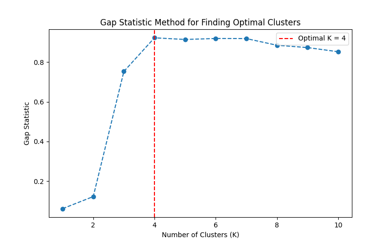

# Gap Statistic Method for Finding Optimal Clusters

## Overview
The **Gap Statistic Method** is an advanced clustering evaluation technique used to determine the optimal number of clusters (K) in unsupervised learning. Unlike traditional methods such as the Elbow Method or Silhouette Score, the Gap Statistic provides a more statistically sound approach by comparing the clustering performance of actual data against a randomly distributed reference dataset.

## Why Use the Gap Statistic?
- **Automated Cluster Selection:** Avoids the need for manual visual inspection.
- **More Robust Than the Elbow Method:** Provides a quantitative measure instead of relying on visual interpretation.
- **Useful for Various Applications:** Can be applied in customer segmentation, anomaly detection, and unsupervised learning problems.

## How It Works
1. Compute within-cluster dispersion for different values of K.
2. Generate B random reference datasets with the same data range as the actual dataset.
3. Compute dispersion for the reference datasets.
4. Calculate the **Gap value**, which is the difference between log(reference dispersion) and log(actual dispersion).
5. Select the K value where the Gap is maximized.

## Installation
Ensure you have Python and the required dependencies installed.
```bash
pip install numpy matplotlib scikit-learn
```

## Usage
To run the script, simply execute:
```bash
python gapstatistic.py
```

## Code Implementation
The core functionality is in the `compute_gap_statistic()` function, which:
- Computes within-cluster dispersion for various K values.
- Creates random reference datasets for comparison.
- Determines the optimal number of clusters by maximizing the Gap value.

### Example Code Snippet:
```python
optimal_k, gap_values = compute_gap_statistic(X, k_max=10)
```

## Visualization
The script generates a plot displaying the Gap Statistic for different K values, highlighting the optimal number of clusters.

  

## Example Output
```
The optimal number of clusters determined by the Gap Statistic is: 5
```

## Potential Enhancements
- Extend to **DBSCAN** and **Hierarchical Clustering**.
- Adapt for real-world datasets like **customer segmentation**.
- Convert into a Python package for easy use.


