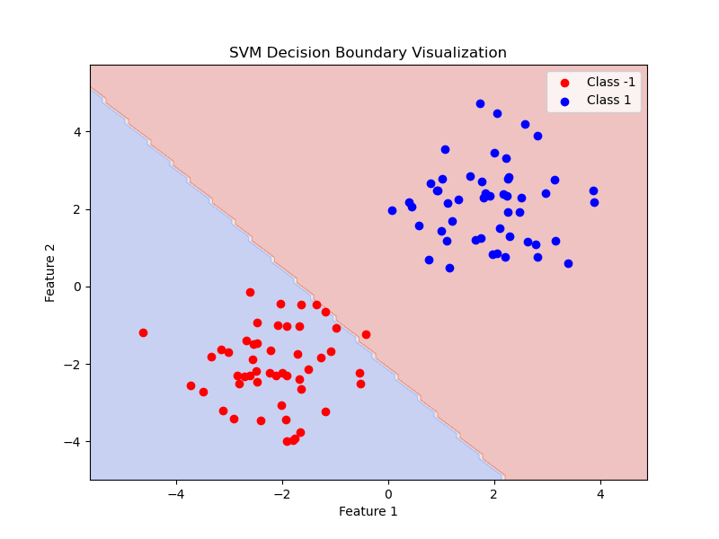

# Support Vector Machine (SVM) from Scratch  

A simple **Support Vector Machine (SVM) classifier** implemented from scratch using **NumPy** and **Stochastic Gradient Descent (SGD)** for training. This project includes **model training, prediction, and decision boundary visualization**.

---

## 📌 Support Vector Machine (SVM) Implementation  
In this project, we implement an **SVM model** that:  
✅ Uses **gradient descent** to optimize weights and bias.  
✅ Uses a **hinge loss function** for classification.  
✅ Implements **L2 regularization** to prevent overfitting.  
✅ Separates **two linearly separable classes** with a decision boundary.  

The decision function follows:  

$$f(X) = XW + b$$

Where:
- **W** represents the weights (hyperplane coefficients).  
- **b** represents the bias term.  

The loss function used is **Hinge Loss**, given by:  

$$L = Σ max(0, 1 - y (XW + b)) + λ ||W||²$$


The model is trained using **Stochastic Gradient Descent (SGD)**, iteratively updating weights and bias.

---

## 📊 SVM Decision Boundary Visualization  
To evaluate the model, we generate a **synthetic dataset** with two distinct classes.  
- **Class -1 (Red points)**  
- **Class +1 (Blue points)**  
- The **decision boundary** is visualized with a **color-filled background**.  

### **SVM Decision Boundary Plot**  
  

This plot helps visualize how well the SVM classifier separates the two classes.

---

## 🛠 Installation & Setup  
### **1️⃣ Clone the Repository**  
```bash
git clone https://github.com/kavinrog/TheCodeChronicles.git
cd SVM
```

### **2️⃣ Install Dependencies**  
Ensure you have **Python 3+** installed. Install required libraries using:  
```bash
pip install numpy matplotlib scikit-learn
```

### **3️⃣ Run the Code**  
To execute the SVM model and visualize the decision boundary, run:  
```bash
python svm.py
```

---

## 📜 Code Overview  
### **SVM Class**  
- `fit(X, y)`: Trains the model using **SGD optimization**.  
- `predict(X)`: Predicts class labels for new data.  

### **Plotting the Decision Boundary**  
The `plot_decision_boundary` function:
- Creates a **mesh grid** of the feature space.  
- Uses `contourf()` to **fill the regions** with predicted class colors.  
